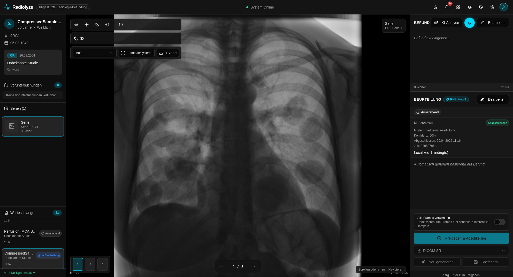

# Getting Started with Radiolyze

## What is Radiolyze?

Radiolyze is an open-source radiology workflow system that combines:

- a **DICOM viewer** for viewing and navigating medical images
- **AI-assisted reporting** (MedGemma) that drafts findings and impressions from images
- **voice dictation** (MedASR or Whisper) so radiologists can speak findings hands-free
- **structured quality checks** that flag incomplete or inconsistent reports
- **audit logging** that records every AI interaction for EU AI Act compliance

The system runs entirely on-premises — patient data never leaves your infrastructure.

---

## Who is Radiolyze for?

| Role | What Radiolyze helps with |
|---|---|
| **Radiologist / Physician** | Faster reporting: AI drafts findings, voice replaces typing, QA catches errors |
| **IT Administrator** | Docker-based deployment, GPU support (NVIDIA/AMD), DICOM integration via Orthanc |
| **Researcher / AI Specialist** | Pluggable inference backend, audit trail, prompt customisation |
| **Compliance Officer** | EU AI Act Article 12–15 logging, human oversight, Annex IV documentation |
| **Developer / Contributor** | TypeScript + React frontend, FastAPI backend, open and extensible |

---

## What Radiolyze is NOT

- **Not a medical device.** Radiolyze is **NOT** certified / approved and carries **no** CE marking.
- **Not for clinical use / diagnostic purposes.** Radiolyze is provided **exclusively for research and education** (use only anonymised or synthetic data).
- **Not a replacement for radiologist judgment.** AI output is a draft that must be reviewed and approved by a qualified physician.

See: [Disclaimer](../legal/disclaimer.md)

---

## Your First 10 Minutes (no AI required)

If you just want to understand the workflow quickly, do this first:

1. Start the stack with demo data: follow the [Quickstart Guide](quickstart.md).
2. Open the UI at `http://localhost:5173` and select a study from the worklist.
3. Scroll through frames, try a window preset, and add a short finding in the right panel.
4. Approve the report (the system is fully usable without GPU/AI inference).

Once you are comfortable, enable GPU inference and/or voice dictation overlays as needed.

---

## System Requirements Overview

| Component | Minimum | Recommended |
|---|---|---|
| CPU | 4 cores | 8+ cores |
| RAM | 8 GB | 16–32 GB |
| GPU | None (CPU mode) | NVIDIA with 16 GB VRAM (for MedGemma) |
| Storage | 20 GB (OS + stack) | 100+ GB (DICOM archive) |
| OS | Linux (any modern) | Ubuntu 22.04 LTS |
| Docker | 24.x + Compose v2 | Latest stable |

---

## Choose Your Path

=== "Radiologist"
    **Goal:** Use the system for daily reporting.

    1. Ask your administrator to install Radiolyze and load DICOM studies.
    2. Read the [Doctor's Guide](../doctors/index.md) for the reporting workflow.
    3. Try the [Fast Reporting Workflow](../workflows/fast-report.md) for chest X-rays.

=== "New to the project"
    **Goal:** See Radiolyze running with demo data in 5 minutes.

    1. Install Docker and Docker Compose.
    2. Follow the [Quickstart Guide](quickstart.md).
    3. Explore the demo studies that load automatically.

=== "Administrator"
    **Goal:** Deploy Radiolyze in a hospital network.

    1. Review [System Requirements](../admin/index.md#system-requirements).
    2. Follow the [Deployment Guide](../admin/index.md).
    3. Configure [Security Hardening](../admin/index.md#security) before going live.

=== "Researcher"
    **Goal:** Evaluate or extend the AI capabilities.

    1. Read the [MedGemma Model Guide](../research/index.md).
    2. Review the [data flow](../architecture/data-flow.md) for privacy analysis.
    3. Follow the guide to [replace the inference backend](../research/index.md#switching-the-inference-backend).

=== "Developer"
    **Goal:** Set up a local development environment and contribute.

    1. Follow [Development Setup](../development/setup.md).
    2. Read [Contributing Guidelines](../development/contributing.md).
    3. Explore the [Architecture Overview](../architecture/overview.md).
